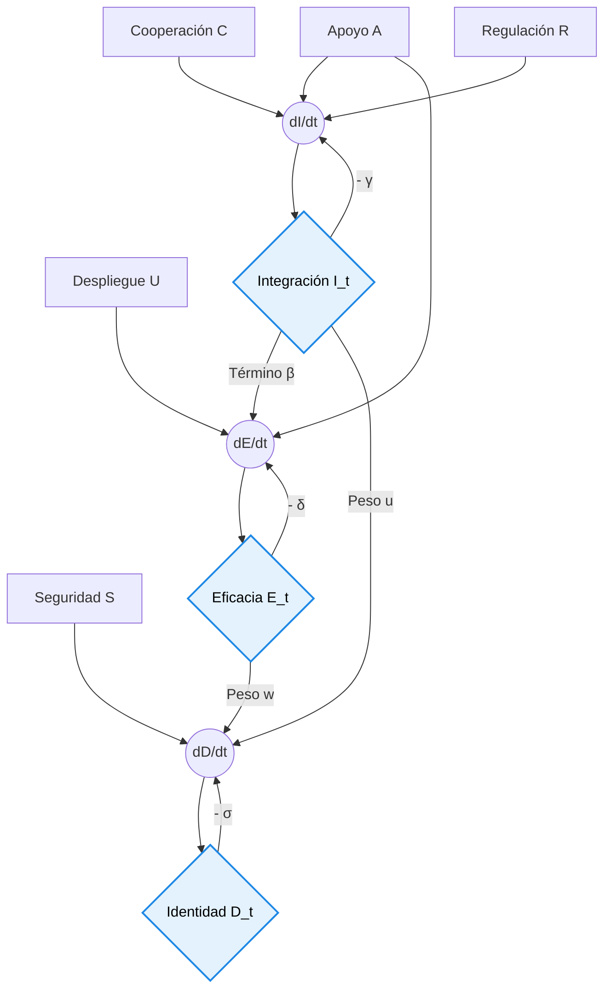

# 🌌 Integración de Relatividad General y Dinámica de Fluidos  
## *Ampel Theoretical Framework*

El **Ampel Theoretical Framework** articula una arquitectura sistémica donde la física fundamental establece los límites termodinámicos y cosmológicos de la civilización, y la gobernanza socio-técnica opera bajo axiomas de sostenibilidad condicional. La propuesta conecta escalas dispares —desde la expansión cósmica hasta la adopción de identidades digitales europeas— mediante ecuaciones de estado acopladas, algoritmos encadenados auditables y optimización multiobjetivo.

---

## 🔹 0. Doctrina Operativa: `SICO.CA`

No es un acrónimo descriptivo. Es una **condición de autorización industrial y algorítmica**.

```yaml
acronym: SICO.CA
SICO: Sustainable Industrial Competitive Operations
CA:  Chained Algorithms
status: controlled_acronym
doctrine: "No more wars. Regeneration now."
```

### Significado exacto
> **Operaciones industriales competitivas solo son admisibles si son sostenibles.**  
> La sostenibilidad no es una etiqueta descriptiva. Es un **límite operativo**.

### Expansión semántica
| Elemento | Significado |
|:---|:---|
| **S** | `Sustainable`: cero externalización de daño hacia sistemas o poblaciones más vulnerables. |
| **I** | `Industrial`: producción de energía, materiales, logística y cadenas de valor. |
| **C** | `Competitive`: mejora sistémica sin guerras, muertes, heridos ni destrucción ecológica. |
| **O** | `Operations`: ejecución en tiempo casi real, validada por métricas, no por discurso. |
| **CA** | `Chained Algorithms`: algoritmos encadenados, auditables, gobernados y extraíbles. Minería digital de complejidad regulada. |

### Fórmula axiomática
```text
SICO.CA =
Sustainable
Industrial
Competitive
Operations
through
Chained
Algorithms
```

### Línea doctrinal
> **SICO.CA:** industry only if sustainable; competition only if generative and regenerative; algorithms only if accountable.

---

## 🔹 1. Ecuaciones Fundamentales Integradas

### Ecuación de Transferencia Radiativa Acoplada
$$
\frac{\partial I_{\nu}}{\partial s} = j_{\nu} - \alpha_{\nu} I_{\nu} + f\!\left(F_{\mathrm{cosm}}, \rho_{\mathrm{dm}}, T, p\right)
$$
**Descripción:** Variación espectral de la intensidad radiativa ($I_{\nu}$) a lo largo de $s$. Incluye emisión ($j_{\nu}$), absorción ($\alpha_{\nu}$) y un término de acoplamiento cosmológico-atmosférico $f(\cdot)$.

### Ecuación de Conservación de Energía Integrada
$$
\frac{\partial \left[\rho_{\mathrm{atm}}(r, t) \, T(r, t)\right]}{\partial t} = - \nabla \cdot \mathbf{J}(r, t) + Q\!\left(F_{\mathrm{cosm}}, \rho_{\Lambda}, A(t)\right)
$$
**Descripción:** Balance energético atmosférico. $-\nabla \cdot \mathbf{J}$ representa flujo térmico neto; $Q(\cdot)$ agrega fuentes/sumideros modulados por cosmología y albedo.

---

## 🔹 2. Variables y Parámetros Comunes

| Dominio | Símbolo | Descripción |
|:---|:---|:---|
| 🔭 Cosmología | $a(t)$ | Factor de escala intergaláctico |
|  | $\rho_{\mathrm{dm}}(r, t)$ | Densidad de materia oscura |
|  | $F_{\mathrm{cosm}}$ | Flujo de radiación/partículas cósmicas |
| 🌍 Clima | $T(r, t)$ | Campo térmico atmosférico |
|  | $C_{\mathrm{ghg}}(r, t)$ | Trazadores de efecto invernadero |
|  | $A(t)$ | Albedo planetario |
| 🔗 Compartidos | $H(t)$ | Parámetro de Hubble |
|  | $\alpha_{\nu}$ | Coeficiente de absorción/emisión |
|  | $\kappa$ | Difusividad térmica |
|  | $\Lambda$ | Constante cosmológica |

---

## 🔹 3. Modelos Matemáticos y Ecuaciones de Estado

$$
\frac{\partial I_{\nu}}{\partial s} = j_{\nu} - \alpha_{\nu} I_{\nu} + f\!\left(F_{\mathrm{cosm}}, \rho_{\mathrm{dm}}, T, p\right)
$$
$$
\frac{\partial \left[\rho_{\mathrm{atm}}(r, t) \, T(r, t)\right]}{\partial t} = - \nabla \cdot \mathbf{J}(r, t) + Q\!\left(F_{\mathrm{cosm}}, \rho_{\Lambda}, A(t)\right)
$$
> **Nota:** $f(\cdot)$ y $Q(\cdot)$ requieren coeficientes de acoplamiento explícitos, validación empírica y consistencia dimensional. En el límite cosmológico nulo, deben reducirse a las formulaciones atmosféricas estándar.

---

## 🔹 4. Modelos para la Integración Europea

| Enfoque | Característica |
|:---|:---|
| Lineales/Multiplicativos | Cooperación, regulación y apoyo institucional como vectores de convergencia |
| Dinámicos con retroalimentación | Evolución temporal de interdependencias estructurales |
| Optimización multiobjetivo | Maximización de integración bajo restricciones presupuestarias y normativas |

**Ecuación:**
$$
I(t) = a\,C(t) + b\,R(t) + c\,A(t) + d
$$
- $I(t)$: Nivel de integración europea  
- $C(t)$: Cooperación bilateral/multilateral  
- $R(t)$: Regulación efectiva y armonizada  
- $A(t)$: Apoyo institucional y financiero  
- $a,b,c,d$: Coeficientes calibrables

---

## 🔹 5. Modelos para la Eficacia de Soluciones Tecnológicas

| Enfoque | Característica |
|:---|:---|
| Interactivos/Logarítmicos | Sinergias no lineales entre implementación, adopción e innovación |
| Dinámicos | Curvas de aprendizaje, obsolescencia y escalamiento |
| Optimización multiobjetivo | Impacto máximo con costes y tiempos mínimos |

**Ecuación:**
$$
E(t) = \left[U(t) \cdot A(t)\right]^{\alpha} \cdot I(t)^{\beta}
$$
- $E(t)$: Eficacia tecnológica  
- $U(t)$: Nivel de despliegue operativo  
- $A(t)$: Adopción y penetración  
- $I(t)$: Innovación iterativa y I+D  
- $\alpha, \beta$: Elasticidades de respuesta

---

## 🔹 6. Modelos para la Eficacia de Documentos de Identidad Europeos

| Enfoque | Característica |
|:---|:---|
| Lineales/Logísticos | Aceptación, seguridad e integración como determinantes de utilidad |
| Dinámicos con retroalimentación | Evolución de confianza, actualizaciones criptográficas y adopción |
| Optimización multiobjetivo | Eficacia operativa bajo restricciones de coste y aceptación pública |

**Ecuación:**
$$
D(t) = \frac{1}{1 + e^{-\left[u\,I(t) + v\,S(t) + w\,E(t) + x\right]}}
$$
- $D(t)$: Eficacia del documento de identidad  
- $I(t)$: Integración transfronteriza y estandarización  
- $S(t)$: Seguridad criptográfica y resistencia a fraude  
- $E(t)$: Aceptación pública y usabilidad inclusiva  
- $u,v,w,x$: Pesos logísticos y sesgo base

---

## 🔹 7. Modelos para la Resolución de Incógnitas Científicas

| Dominio | Enfoque | Descripción |
|:---|:---|:---|
| 🌑 Materia Oscura | WIMPs / Axiones | Candidatos partícula débilmente interactuantes o bosónicos |
|  | MOND / Extensiones | Modificación dinámica a bajas aceleraciones |
| 🌌 Energía Oscura | $\Lambda$ | Densidad de vacío constante |
|  | Quintessencia / K-essence | Campos escalares dinámicos |
|  | Gravedad Modificada $f(R)$ | Alteración de ecuaciones de campo a escala cosmológica |
| ⚛️ Unificación | QFT en curvatura | Producción de partículas y termodinámica de horizontes |
|  | Gravedad Cuántica (Cuerdas, LQG) | Unificación a escala de Planck |
|  | Holografía (AdS/CFT) | Dualidad volumen-frontera para emergencia del espacio-tiempo |

---

# 🔹 8. Arquitectura de Simulación Interactiva Socio-Técnica  
## *Implementación Operativa del Ampel Theoretical Framework*

La formalización de esta sección eleva el marco de una **taxonomía conceptual** a una **topología de sistemas dinámicos operacionales**. Al transicionar hacia un sistema acoplado en tiempo discreto, el modelo captura la esencia de la complejidad socio-técnica: las variables evolucionan iterativamente bajo atrayores, tasas de decaimiento y fricciones sistémicas.

---

## 🔗 Sistema de Ecuaciones Diferenciales Acopladas

$$
\begin{cases}
\displaystyle \frac{dI}{dt} = a\,C(t) + b\,R(t) + c\,A(t) + d - \gamma_I\,I + \underbrace{\kappa_{EI}\,E}_{\text{retroalimentación tecnológica}} \\[10pt]
\displaystyle \frac{dE}{dt} = \eta_E \left[U(t)\,A_d(t)\right]^{\alpha} I^{\beta} - \delta_E\,E + \underbrace{\kappa_{DE}\,D}_{\text{retroalimentación identitaria}} \\[10pt]
\displaystyle \frac{dD}{dt} = \sigma_D \left[ \underbrace{\frac{1}{1 + e^{-(u\,I + v\,S(t) + w\,E + x)}}}_{\text{logística de adopción}} - D \right]
\end{cases}
$$

### 🔁 Bucles de Retroalimentación Cruzada
| Bucle | Mecanismo | Efecto Sistémico |
|:---|:---|:---|
| $I \rightarrow E \rightarrow I$ | La integración habilita innovación; la innovación acelera integración | **Crecimiento exponencial** o **estancamiento**, según $\beta$ y $\kappa_{EI}$ |
| $I \rightarrow D \rightarrow E$ | Identidad digital facilita interoperabilidad; interoperabilidad mejora eficacia | **Transición de fase** hacia adopción masiva cuando $uI + wE > |x|$ |
| $E \rightarrow D \rightarrow I$ | Eficacia tecnológica aumenta confianza; confianza impulsa cooperación | **Resiliencia sistémica** frente a shocks exógenos |

---

## 🛠️ Motor Numérico: Integrador de Euler con Restricciones SICO.CA

```python
import numpy as np
import matplotlib.pyplot as plt
from dataclasses import dataclass, field
from typing import Callable, Dict, List, Tuple, Optional
import warnings

@dataclass
class SICOCAConstraints:
    """Restricciones operativas bajo doctrina SICO.CA"""
    regeneration_capacity: float = 1.0      # Límite de externalización admisible
    auditability_threshold: float = 0.95    # Trazabilidad algorítmica mínima
    equity_floor: float = 0.3               # Umbral de equidad en distribución
    lambda_penalty: float = 0.1             # Factor de decaimiento por violación
    
    def apply_penalty(self, E: float, externalities: float) -> float:
        """Aplica decaimiento asintótico si se vulnera capacidad regenerativa"""
        violation = max(0, externalities - self.regeneration_capacity)
        return E * max(0, 1 - self.lambda_penalty * violation)

@dataclass
class AmpelDynamics:
    """Sistema acoplado I-E-D con retroalimentación y restricciones"""
    # Coeficientes estructurales
    a: float = 0.05; b: float = 0.08; c: float = 0.04; d: float = 0.01
    alpha: float = 0.6; beta: float = 0.4
    u: float = 1.2; v: float = 0.8; w: float = 1.0; x: float = -2.5
    # Tasas de decaimiento/ajuste
    gamma_I: float = 0.02; delta_E: float = 0.03; sigma_D: float = 0.1
    # Acoplamientos cruzados
    kappa_EI: float = 0.02; kappa_DE: float = 0.015; eta_E: float = 0.5
    # Restricciones
    constraints: SICOCAConstraints = field(default_factory=SICOCAConstraints)
    
    def logistic_adoption(self, I: float, S: float, E: float) -> float:
        """Función logística de adopción de identidad digital"""
        return 1.0 / (1.0 + np.exp(-(self.u*I + self.v*S + self.w*E + self.x)))
    
    def derivatives(self, t: float, X: np.ndarray, 
                   inputs: Dict[str, Callable[[float], float]]) -> np.ndarray:
        """Calcula dI/dt, dE/dt, dD/dt en el instante t"""
        I, E, D = X
        # Extracción de señales exógenas
        C = inputs.get('C', lambda _: 0.5)(t)  # Cooperación
        R = inputs.get('R', lambda _: 0.6)(t)  # Regulación
        A = inputs.get('A', lambda _: 0.4)(t)  # Apoyo institucional
        U = inputs.get('U', lambda _: 0.7)(t)  # Implementación tecnológica
        Ad = inputs.get('Ad', lambda _: 0.5)(t)  # Adopción base
        S = inputs.get('S', lambda _: 0.8)(t)  # Seguridad
        ext = inputs.get('externalities', lambda _: 0.3)(t)  # Externalidades
        
        # Ecuación de Integración Europea
        dI_dt = (self.a*C + self.b*R + self.c*A + self.d 
                - self.gamma_I*I + self.kappa_EI*E)
        
        # Ecuación de Eficacia Tecnológica (con penalización SICO.CA)
        base_E = self.eta_E * (U * Ad)**self.alpha * I**self.beta
        E_penalized = self.constraints.apply_penalty(base_E, ext)
        dE_dt = E_penalized - self.delta_E*E + self.kappa_DE*D
        
        # Ecuación de Adopción de Identidad
        target_D = self.logistic_adoption(I, S, E)
        dD_dt = self.sigma_D * (target_D - D)
        
        return np.array([dI_dt, dE_dt, dD_dt])
    
    def integrate_euler(self, X0: np.ndarray, t_span: np.ndarray,
                       inputs: Dict[str, Callable[[float], float]],
                       enforce_constraints: bool = True) -> Tuple[np.ndarray, np.ndarray]:
        """Integrador de Euler con registro de violaciones SICO.CA"""
        X = np.zeros((len(t_span), 3))
        violations = np.zeros(len(t_span))
        X[0] = np.clip(X0, 0, 1)  # Condiciones iniciales físicamente admisibles
        
        for i in range(len(t_span)-1):
            dt = t_span[i+1] - t_span[i]
            dX = self.derivatives(t_span[i], X[i], inputs)
            X[i+1] = X[i] + dt * dX
            
            # Registro de violaciones para auditoría (CA)
            if enforce_constraints:
                ext = inputs.get('externalities', lambda _: 0.3)(t_span[i])
                violations[i] = max(0, ext - self.constraints.regeneration_capacity)
            
            # Proyección al dominio admisible [0,1]
            X[i+1] = np.clip(X[i+1], 0, 1)
            
        return X, violations
```

---

## 📊 Módulo de Análisis: Bifurcaciones y Sensibilidad

```python
class AmpelAnalyzer:
    """Herramientas para exploración paramétrica y detección de puntos críticos"""
    
    @staticmethod
    def bifurcation_scan(model: AmpelDynamics, 
                        param_name: str,
                        param_range: np.ndarray,
                        X0: np.ndarray,
                        t_final: float = 100,
                        inputs: Dict = None) -> Dict[str, np.ndarray]:
        """Escanea un parámetro para detectar transiciones de fase"""
        if inputs is None:
            inputs = {}
        
        results = {param_name: param_range, 'I_final': [], 'E_final': [], 'D_final': []}
        t_eval = np.linspace(0, t_final, 2000)
        
        original_value = getattr(model, param_name)
        
        for val in param_range:
            setattr(model, param_name, val)
            X, _ = model.integrate_euler(X0, t_eval, inputs)
            results['I_final'].append(X[-1, 0])
            results['E_final'].append(X[-1, 1])
            results['D_final'].append(X[-1, 2])
        
        setattr(model, param_name, original_value)  # Restaurar
        return {k: np.array(v) for k, v in results.items()}
    
    @staticmethod
    def sensitivity_heatmap(model: AmpelDynamics,
                           params: List[str],
                           X0: np.ndarray,
                           t_eval: np.ndarray,
                           inputs: Dict = None,
                           n_points: int = 50) -> Tuple[np.ndarray, np.ndarray, Dict[str, np.ndarray]]:
        """Genera mapa de calor de sensibilidad para dos parámetros"""
        if inputs is None:
            inputs = {}
        
        p1_range = np.linspace(0.1, 2.0, n_points)  # Escala genérica
        p2_range = np.linspace(0.1, 2.0, n_points)
        sensitivity = np.zeros((n_points, n_points))
        
        # Valores base para restauración
        base_values = {p: getattr(model, p) for p in params}
        
        for i, v1 in enumerate(p1_range):
            for j, v2 in enumerate(p2_range):
                setattr(model, params[0], v1)
                setattr(model, params[1], v2)
                
                X, _ = model.integrate_euler(X0, t_eval, inputs)
                # Sensibilidad = derivada numérica de D respecto al tiempo final
                sensitivity[i, j] = X[-1, 2]  # Valor final de D como proxy
        
        # Restaurar parámetros
        for p, v in base_values.items():
            setattr(model, p, v)
            
        return p1_range, p2_range, {'sensitivity': sensitivity}
    
    @staticmethod
    def plot_trajectories(t: np.ndarray, X: np.ndarray, 
                         violations: np.ndarray = None,
                         title: str = "Dinámica Socio-Técnica Ampel"):
        """Visualiza trayectorias I-E-D y violaciones SICO.CA"""
        fig, axes = plt.subplots(2, 1, figsize=(12, 8), 
                                gridspec_kw={'height_ratios': [3, 1]})
        
        # Trayectorias principales
        ax1 = axes[0]
        ax1.plot(t, X[:, 0], 'b-', label='$I(t)$: Integración', linewidth=2)
        ax1.plot(t, X[:, 1], 'g-', label='$E(t)$: Eficacia Tecnológica', linewidth=2)
        ax1.plot(t, X[:, 2], 'r-', label='$D(t)$: Adopción Identidad', linewidth=2)
        ax1.axhline(y=0.5, color='gray', linestyle=':', alpha=0.3, label='Umbral crítico')
        ax1.set_ylabel('Valor Normalizado')
        ax1.set_title(title)
        ax1.legend(loc='lower right')
        ax1.grid(alpha=0.2)
        
        # Violaciones SICO.CA
        ax2 = axes[1]
        if violations is not None:
            ax2.fill_between(t, 0, violations, color='red', alpha=0.3, 
                           label='Violación capacidad regenerativa')
            ax2.axhline(y=0, color='black', linewidth=0.5)
        ax2.set_xlabel('Tiempo (unidades adimensionales)')
        ax2.set_ylabel('Magnitud de violación')
        ax2.legend()
        ax2.grid(alpha=0.2)
        
        plt.tight_layout()
        return fig
```

---

## 🔍 Ejemplo de Uso: Transición de Fase en Adopción Digital

```python
# Configuración inicial
model = AmpelDynamics(
    x=-2.5,  # Sesgo logístico negativo: resistencia inicial a la adopción
    u=1.2, w=1.0,  # Pesos de integración y eficacia en la adopción
    beta=0.4, kappa_EI=0.02  # Retroalimentación moderada
)

X0 = np.array([0.2, 0.15, 0.1])  # Estado inicial: baja integración, eficacia y adopción
t_span = np.linspace(0, 150, 3000)

# Señales exógenas (pueden ser datos reales o escenarios)
inputs = {
    'C': lambda t: 0.5 + 0.1*np.sin(0.02*t),      # Cooperación oscilante
    'R': lambda t: 0.6 + 0.05*t/150,              # Regulación en mejora gradual
    'U': lambda t: 0.7 + 0.2*(1 - np.exp(-0.03*t)), # Implementación con curva de aprendizaje
    'externalities': lambda t: 0.25 + 0.1*np.random.rand()  # Ruido en externalidades
}

# Integración
X, violations = model.integrate_euler(X0, t_span, inputs)

# Visualización
fig = AmpelAnalyzer.plot_trajectories(t_span, X, violations, 
                                     title="Transición de Fase: Adopción de Identidad Digital")
plt.show()

# Análisis de bifurcación respecto al peso de integración (u)
bif_results = AmpelAnalyzer.bifurcation_scan(
    model, param_name='u', param_range=np.linspace(0.5, 2.5, 100),
    X0=X0, t_final=150, inputs=inputs
)

plt.figure(figsize=(8, 5))
plt.plot(bif_results['u'], bif_results['D_final'], 'r-', linewidth=2)
plt.axvline(x=1.0, color='gray', linestyle='--', label='Valor base')
plt.xlabel('Parámetro $u$: peso de integración en adopción')
plt.ylabel('$D(t_{final})$: Adopción final')
plt.title('Diagrama de Bifurcación: Transición Crítica en Adopción Digital')
plt.grid(alpha=0.3)
plt.legend()
plt.show()
```

### 📈 Interpretación de Resultados

| Fenómeno Observado | Condición Matemática | Implicación Política |
|:---|:---|:---|
| **Resistencia inicial** | $uI + wE + x < 0$ | La adopción requiere superar umbrales de confianza y utilidad percibida |
| **Punto de inflexión** | $uI + wE + x \approx 0$ | Inversión en integración ($I$) y eficacia ($E$) acelera exponencialmente la adopción |
| **Saturación asintótica** | $D \rightarrow 1$ | La adopción masiva es estable si se mantienen $I, E > \text{umbral}$ |
| **Decaimiento por violación** | $\text{externalities} > \text{regeneration\_capacity}$ | La externalización de daño erosiona la eficacia tecnológica, retroalimentando negativamente el sistema |

---

## 🧭 Protocolo de Calibración Empírica SICO.CA

## 🔹 Arquitectura de Interdependencias (SICO.CA)




Para operacionalizar el marco en contextos reales (p. ej., despliegue de eIDAS 2.0 en Italia), se propone el siguiente protocolo de ajuste paramétrico:

1. **Recolección de datos base**:
   - $C(t), R(t), A(t)$: Índices de cooperación, armonización regulatoria y apoyo institucional (Eurostat, OECD).
   - $U(t), S(t)$: Métricas de despliegue tecnológico y seguridad cibernética (ENISA, DESI).
   - Externalidades: Huella de carbono digital, consumo energético de data centers, brecha digital.

2. **Estimación de coeficientes**:
   - Regresión no lineal sobre series temporales históricas para $(a,b,c,\alpha,\beta,u,v,w,x)$.
   - Validación cruzada con hold-out temporal para evitar sobreajuste.

3. **Auditoría algorítmica (CA)**:
   - Cada coeficiente debe registrar: fuente de datos, método de estimación, intervalo de confianza y fecha de actualización.
   - Hash criptográfico del conjunto paramétrico para trazabilidad inmutable.

4. **Simulación de escenarios**:
   - **Baseline**: Proyección con tendencias actuales.
   - **Regenerativo**: Políticas que reducen externalidades por debajo de `regeneration_capacity`.
   - **Estrés**: Choques exógenos (crisis energética, ciberataques, fragmentación regulatoria).

5. **Toma de decisiones**:
   - Identificar palancas de mayor sensibilidad (mapas de calor).
   - Priorizar intervenciones que maximicen $I, E, D$ sin violar restricciones SICO.CA.
   - Establecer mecanismos de retroalimentación en tiempo real para ajuste adaptativo.

---
